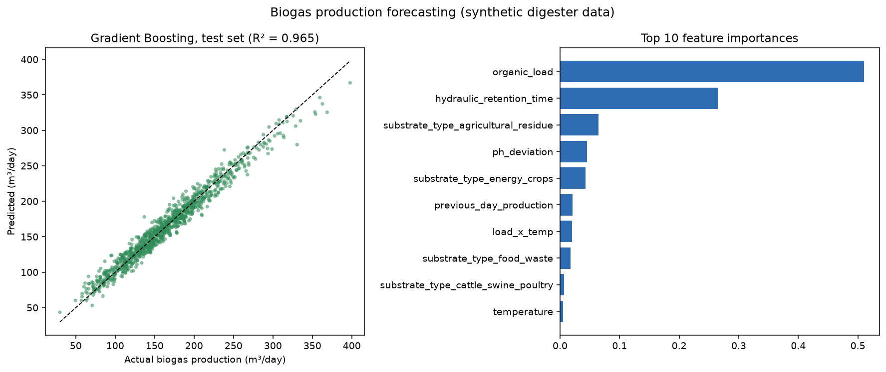

# Biogas production forecasting

[](https://github.com/Brunnobach/biogas-mlops/actions/workflows/ci-cd.yml)
[Live demo](https://brunnobach.github.io/biogas-mlops/)

Plant operators need a daily biogas volume they can plan around. Digester temperature, pH, organic load, retention time and substrate mix all move production, but the relationship is non-linear and noisy.

This repository is a compact, deployable forecasting stack: a physically inspired synthetic dataset, a scikit-learn Gradient Boosting model with MLflow tracking, a FastAPI inference service, and a browser demo on GitHub Pages.

**Holdout result (20% test split, `random_state=42`):** R² **0.965**, RMSE **10.4** m³/day, MAE **8.2** m³/day. Organic load and hydraulic retention time dominate feature importance, which matches how anaerobic digesters actually scale gas yield.



The figure is generated by `src/models/train.py` from this repo’s model. **The dataset is synthetic and physically inspired** — it is not telemetry from a real plant. Use it to evaluate the pipeline, not as a substitute for site measurements.

## Live demo

**Predictor UI:** https://brunnobach.github.io/biogas-mlops/

On GitHub Pages the app runs a client-side physics-inspired formula (demo mode). With the local FastAPI service running, click **Connect** and forecasts use the trained model via `POST /predict` (CORS enabled).

## Quick start

```bash
git clone https://github.com/Brunnobach/biogas-mlops.git
cd biogas-mlops

python3 -m venv .venv
source .venv/bin/activate
pip install -r requirements.txt

python src/data/generate_dataset.py
python src/models/train.py

python -m uvicorn src.api.app:app --reload
```

Then open http://localhost:8000/docs or the Pages UI and point it at `http://localhost:8000`.

## API usage

```bash
curl -X POST "http://localhost:8000/predict" \
  -H "Content-Type: application/json" \
  -d '{
    "temperature": 37.0,
    "ph": 7.2,
    "organic_load": 3.5,
    "hydraulic_retention_time": 25,
    "substrate_type": "cattle_swine_poultry",
    "humidity": 85,
    "ambient_temperature": 22,
    "previous_day_production": 120,
    "month": 6
  }'
```

`month` is part of the feature set (cyclical calendar encoding). The service also exposes `GET /health` and interactive docs at `/docs`.

## Tech stack

| Layer | Tools |
|-------|--------|
| Data & features | Python 3.11, pandas, NumPy |
| Model | scikit-learn `GradientBoostingRegressor` |
| Tracking | MLflow (experiment log + optional local UI) |
| Inference | FastAPI, uvicorn, pydantic |
| Packaging | Docker, Docker Compose |
| Quality / CD | pytest, GitHub Actions, GitHub Pages |

## What the pipeline does

```
synthetic digester data  →  feature engineering  →  Gradient Boosting
         │                                              │
         │                                              ▼
         │                                    MLflow tracking + local .pkl
         │                                              │
         ▼                                              ▼
   GitHub Pages demo                          FastAPI POST /predict
   (physics-inspired fallback)                (trained model)
```

Training logs hyperparameters, RMSE / MAE / R², and the sklearn pipeline. If an MLflow server is not running, training still writes `models/biogas_model.pkl` and `models/metrics.json`.

## Dataset

Rows are generated in `src/data/generate_dataset.py`. Features mimic biodigester operations; the target is daily biogas volume (m³/day) from a simplified, physically motivated formula plus noise.

| Feature | Description |
|---------|-------------|
| `temperature` | Digester temperature (°C) |
| `ph` | Digester pH |
| `organic_load` | Organic load (kg VS / m³ / day) |
| `hydraulic_retention_time` | HRT (days) |
| `substrate_type` | Livestock waste, energy crops, food waste, or agricultural residue |
| `humidity` | Substrate moisture (%) |
| `ambient_temperature` | External temperature (°C) |
| `previous_day_production` | Lag feature (m³ / day) |
| `month` | Calendar month (1–12) |
| `biogas_production` | **Target** (m³ / day) |

## Docker Compose

```bash
docker compose up -d
```

This starts:

- **MLflow** at http://localhost:5000
- **FastAPI** at http://localhost:8000

The API container generates data, trains the model, and serves predictions.

## Project layout

```
biogas-mlops/
├── .github/workflows/      # Tests, image build, Pages deploy
├── assets/                 # Evaluation plots used in this README
├── src/
│   ├── data/               # Synthetic dataset generator
│   ├── features/           # Feature engineering
│   ├── models/             # Training and evaluation plot
│   ├── api/                # FastAPI app
│   └── utils/              # Configuration
├── tests/
├── index.html              # Pages demo UI
├── Dockerfile
├── docker-compose.yml
├── requirements.txt
└── README.md
```

Generated CSVs, the pickle, MLflow runs and `__pycache__` are gitignored. `python src/data/generate_dataset.py` and `python src/models/train.py` recreate them locally.

## CI

Every push and pull request against `main` installs dependencies, regenerates data, trains, runs pytest, and builds the Docker image.

Deploy to GitHub Pages uses `actions/upload-pages-artifact` and `actions/deploy-pages`, and runs only on pushes to `main` (not on pull requests). GitHub Pages must use **GitHub Actions** as its publishing source for that deploy job to succeed after merge.

## Author

[Brunno Bachmann](https://www.linkedin.com/in/brunno-bachmann-865429173) — bioprocess engineer and Python developer. This repo is a working sample for freelance forecasting and MLOps work.

- [GitHub](https://github.com/Brunnobach/biogas-mlops)
- [LinkedIn](https://www.linkedin.com/in/brunno-bachmann-865429173)

## License

MIT
